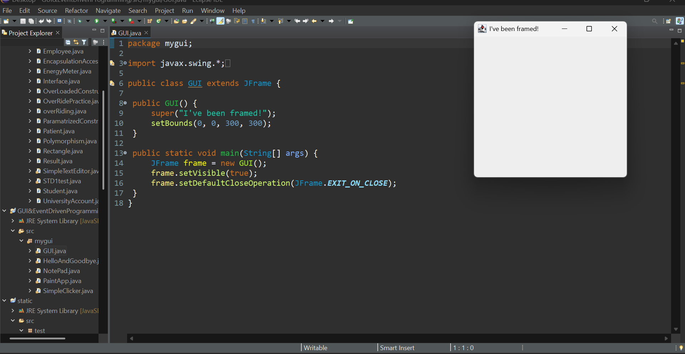

# ☕ Java Swing GUI Lab

> A hands-on collection of Java GUI programs built using `javax.swing` — created while learning GUI & Event-Driven Programming in Java.

---

## 📸 Screenshots

✅ 

---

## 🗂️ What's Inside

| File | Description |
|------|-------------|
| `GUI.java` | Basic JFrame window — the "Hello World" of Swing |

---

## 🚀 How to Run

1. Make sure you have **JDK 8+** installed
2. Clone the repo:
```bash
   git clone https://github.com/YOUR_USERNAME/java-swing-gui-lab.git
```
3. Open in **Eclipse IDE**
4. Run any `.java` file with a `main()` method

---

## 🛠️ Tech Stack

- Java (JDK 8+)
- javax.swing
- Eclipse IDE

---

## 📅 Progress Log

| Date | What I Learned |
|------|----------------|
| Today | Created first JFrame window with `setBounds` and `setVisible` |

> ✏️ *I update this as I learn new things daily!*

---

## 🌱 Coming Soon

- [ ] Buttons & Event Listeners
- [ ] Text Fields & Labels
- [ ] Paint App
- [ ] Notepad Clone

---

## 🙋‍♂️ Author

**Laiba Azeem**  
📍 Pakistan | Learning Java GUI one frame at a time 😄

[GitHub](https://github.com/laibaazeem3250-ship-it)
